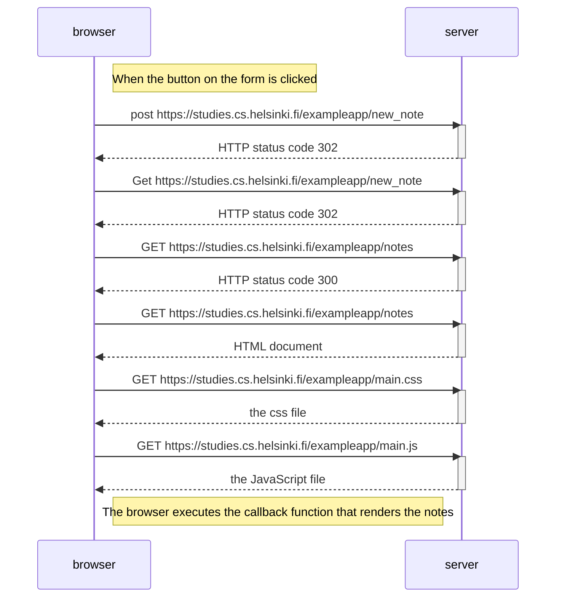

```mermaid
sequenceDiagram
    participant browser
    participant server

    Note right of browser: When the button on the form is clicked
    browser->>server: post https://studies.cs.helsinki.fi/exampleapp/new_note
    activate server
    server-->>browser: HTTP status code 302 
    deactivate server
    
    browser->>server: Get https://studies.cs.helsinki.fi/exampleapp/new_note
    activate server
    server-->>browser: HTTP status code 302 
    deactivate server
    
    browser->>server: GET https://studies.cs.helsinki.fi/exampleapp/notes
    activate server
    server-->>browser: HTTP status code 300 
    deactivate server
    
    browser->>server: GET https://studies.cs.helsinki.fi/exampleapp/notes
    activate server
    server-->>browser: HTML document
    deactivate server

    browser->>server: GET https://studies.cs.helsinki.fi/exampleapp/main.css
    activate server
    server-->>browser: the css file
    deactivate server

    browser->>server: GET https://studies.cs.helsinki.fi/exampleapp/main.js 
    activate server
    server-->>browser: the JavaScript file
    deactivate server
    
    Note right of browser: The browser executes the callback function that renders the notes
```
