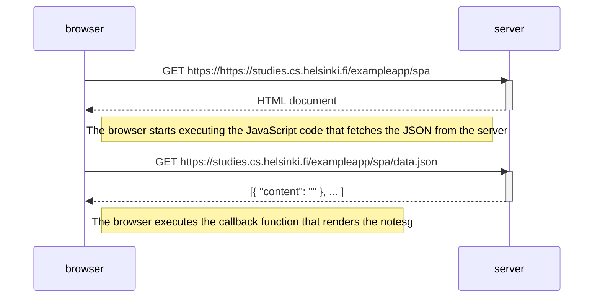

```mermaid
sequenceDiagram
    participant browser
    participant server

    browser->>server: GET https://https://studies.cs.helsinki.fi/exampleapp/spa
    activate server
    server-->>browser: HTML document
    deactivate server

    Note right of browser: The browser starts executing the JavaScript code that fetches the JSON from the server

    browser->>server: GET https://studies.cs.helsinki.fi/exampleapp/spa/data.json
    activate server
    server-->>browser: [{ "content": "" }, ... ]
    deactivate server

    Note right of browser: The browser executes the callback function that renders the notesg
    activate server
```
